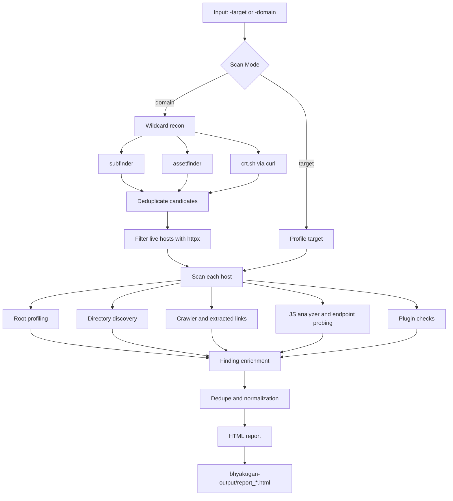

# BHYAKUGAN (ビャクガン) 👁️

[](https://golang.org/)
[](LICENSE)
[](https://github.com/areksaxyz/bhyakugan)

```text
   ▄▄▄▄    ██░ ██▓██   ██▓ ▄▄▄       ██ ▄█▀ █    ██   ▄████  ▄▄▄       ███▄    █
   ▓█████▄ ▓██░ ██▒▒██  ██▒▒████▄     ██▄█▒  ██  ▓██▒ ██▒ ▀█▒▒████▄     ██ ▀█   █
   ▒██▒ ▄██▒██▀▀██░ ▒██ ██░▒██  ▀█▄  ▓███▄░ ▓██  ▒██░▒██░▄▄▄░▒██  ▀█▄  ▓██  ▀█ ██▒
   ▒██░█▀  ░▓█ ░██  ░ ▐██▓░░██▄▄▄▄██ ▓██ █▄ ▓▓█  ░██░░▓█  ██▓░██▄▄▄▄██ ▓██▒  ▐▌██▒
   ░▓█  ▀█▓░▓█▒░██▓ ░ ██▒▓░ ▓█   ▓██▒▒██▒ █▄▒▒█████▓ ░▒▓███▀▒ ▓█   ▓██▒▒██░   ▓██░
   ░▒▓███▀▒ ▒ ░░▒░▒  ██▒▒▒  ▒▒   ▓▒█░▒ ▒▒ ▓▒░▒▓▒ ▒ ▒  ░▒   ▒  ▒▒   ▓▒█░░ ▒░   ▒ ▒
   ▒░▒   ░  ▒ ░▒░ ░▓██ ░▒░   ▒   ▒▒ ░░ ░▒ ▒░░░▒░ ░ ░   ░   ░   ▒   ▒▒ ░░ ░░   ░ ▒░
   ░    ░  ░  ░░ ░▒ ▒ ░░    ░   ▒   ░ ░░ ░  ░░░ ░ ░ ░ ░   ░   ░   ▒      ░   ░ ░
   ░       ░  ░  ░░ ░           ░  ░░  ░      ░           ░       ░  ░         ░
   ░         ░ ░
```

## Bhyakugan

**Bhyakugan** is a Go-based scanner for **public exposure**, **sensitive artifact discovery**, and **recon intelligence** on web targets without assuming authenticated access.

The project is intentionally **exposure-first**, not exploit-first. Its strongest use case is mapping unauthenticated attack surface, validating public exposures, collecting high-signal recon, and separating those results from noisier active checks.

Features • Installation • Quick Start • Runtime Modes • Wordlists • Reporting • Regression • Project Structure

## Legal Disclaimer

Bhyakugan is designed for **authorized security testing** and **educational use** only.

- Legal use: assets you own, labs, bug bounty targets within program rules, and systems you have explicit written permission to test.
- Illegal use: unauthorized access, disruptive testing, or any activity outside approved scope.

You are responsible for ensuring you have permission before scanning any target.

## Features

### Exposure-first runtime model

- `public` mode is the default and prioritizes public exposure checks and recon intelligence.
- `extended` adds broader surface and misconfiguration signals.
- `research` enables noisier and more exploit-oriented families for lab or deeper investigation.
- Legacy aliases still work: `strict`, `balanced`, `aggressive`, `bounty`, `lab`.

### Public exposure and recon coverage

- Sensitive artifact discovery: config leaks, backup files, archives, debug artifacts, interesting public files.
- JS and frontend intelligence: endpoint references, internal route hints, sourcemap-adjacent findings, secret keyword matches.
- GraphQL discovery: endpoint probing, safe request markers, introspection/config exposure detection.
- Public storage and infrastructure signals: bucket/container exposure checks, metadata and URL-fetch surface discovery.
- Attack surface mapping: admin paths, login forms, robots/sitemaps, framework and endpoint references.

### Safer report model

- Findings are separated into:
  - `Validated Public Exposures`
  - `Probable Sensitive Signals`
  - `Recon / Attack Surface`
- Severity is reserved for validated exposures so recon does not pollute the main risk summary.
- Confidence and bucket classification use canonical internal status types rather than loose string labels.

### Built-in regression guardrails

- Report-level regression prevents contradictions like `CONFIRMED` plus signal-only wording.
- Golden-file HTML regression keeps report layout and dashboard buckets stable.
- Runtime-mode regression verifies `public` does not silently enable research-only plugin families.
- Localhost fullstack regression validates detector behavior against the bundled mock target.

## Prerequisites

### Required

- Go `1.21+`
- Git

### Optional external tools

Bhyakugan can use the following when available for wildcard recon:

| Tool | Purpose |
| --- | --- |
| `subfinder` | Passive subdomain enumeration |
| `assetfinder` | Additional subdomain discovery |
| `httpx` | Live host filtering and HTTP probing |
| `curl` | `crt.sh` enumeration |
| `PayloadsAllTheThings` | Optional external payload corpus via `-patt` or `BHYAKUGAN_PATT` |

If a tool is missing, Bhyakugan will keep running with reduced coverage where possible.

## Installation

### Clone and build

```bash
git clone https://github.com/areksaxyz/bhyakugan.git
cd bhyakugan
make build
```

### Manual build

```bash
go build -ldflags="-X main.version=4.0.0" -o bhyakugan ./cmd/bhyakugan
```

### Install with `go install`

```bash
go install github.com/areksaxyz/bhyakugan/cmd/bhyakugan@latest
```

Build target: `./cmd/bhyakugan`  
Module path: `github.com/areksaxyz/bhyakugan`

## Quick Start

### Single target

```bash
./bhyakugan -target https://api.example.com -mode public
```

### Wildcard / domain scan

```bash
./bhyakugan -domain example.com -depth 1
```

### Research mode with external payload corpus

```bash
./bhyakugan -target https://api.example.com -mode research -patt /path/to/PayloadsAllTheThings
```

### Common flags

| Flag | Description |
| --- | --- |
| `-target` | Scan a single URL |
| `-domain` | Run wildcard recon and scan live hosts |
| `-mode` | `public`, `extended`, `research` plus legacy aliases |
| `-depth` | Crawl depth |
| `-threads` | Worker concurrency |
| `-fast` | Fast triage profile |
| `-strict-validation` | Drop heuristic-only findings |
| `-max-endpoints` | Per-host endpoint cap, `0` = mode-aware auto cap |
| `-patt` | Path to PayloadsAllTheThings |

## Runtime Modes

### `public`

Default mode, optimized for unauthenticated public exposure assessment.

Primary focus:

- `directories`
- `git`
- `graphql`
- `jsanalyzer`
- `recon_html`
- `secrets`
- `public_storage`

### `extended`

Builds on `public` and adds broader surface and misconfiguration checks.

Typical additions:

- `openredirect`
- `proxy`
- `websocket`
- `ormleak`

### `research`

Enables noisier and more exploit-oriented plugin families intended for labs, regression, or deeper manual investigation.

Typical additions:

- `jwt`
- `sqli`
- `ssrf`
- `idor`
- `xpath`
- `ssti`
- `rce`
- `typejuggling`
- bundled `vulns`

### Auto endpoint caps

When `-max-endpoints=0`, the cap is resolved automatically:

| Profile | Default cap |
| --- | --- |
| `fast` | `25` |
| `public` | `75` |
| `extended` | `100` |
| `research` | `150` |

## What Bhyakugan Is Best At

### Validated public exposures

- Public config leaks
- Backup or archive exposure
- Public admin tooling or dashboards
- Public source map exposure
- Public debug, health, or info endpoints
- Public storage exposure

### Probable sensitive signals

- JS references to internal APIs or sensitive routes
- Interesting endpoint names and secret-like keywords
- Safe differential signals that deserve manual follow-up
- Metadata and URL-fetch surfaces

### Recon and attack surface

- Login forms
- `robots.txt` and `sitemap.xml`
- Admin path discovery
- GraphQL endpoint existence
- Public API route references
- Framework and middleware hints

## Reporting

HTML reports are written to `bhyakugan-output/` using private file permissions:

- output directory: `0700`
- report files: `0600`

The report renderer escapes dynamic fields and restricts hyperlinks to `http` and `https`.

### Report dashboard model

```text
Target: https://example.com
Mode: public
Validated Scope Count: 3

Exposure Overview
- Validated Exposures: 3
- Probable Sensitive Signals: 7
- Recon Surfaces: 42
- Live Hosts: 581

Validated Severity
- Critical: 1
- High: 1
- Medium: 1
- Low: 0

Sections
- Validated Public Exposures
- Probable Sensitive Signals
- Recon / Attack Surface
```

### Section meanings

- `Validated Public Exposures`: findings with evidence strong enough to stand as unauthenticated exposure.
- `Probable Sensitive Signals`: meaningful signals that still need manual verification or more context.
- `Recon / Attack Surface`: useful surface mapping and intelligence, not headline vulnerabilities.

## Wordlists and Corpus

Bhyakugan ships with a local corpus under [`wordlists/`](wordlists/README.md).

Current layout:

- `wordlists/discovery`
- `wordlists/verify`
- `wordlists/aggressive`
- flat compatibility files kept at the root of `wordlists/`

### Exposure-first corpus already wired

- discovery paths for `directories`
- `verify/file-interesting-names.txt` for `directories` and public storage
- `graphql-endpoints.txt`, `graphql-params.txt`, `graphql-safe-probes.txt`
- `js-secret-keywords.txt`, `js-endpoint-keywords.txt`, `response-interesting-keywords.txt`
- open redirect and SSRF parameter lists
- safe upload verification probes

### Corpus examples

| Category | Example files |
| --- | --- |
| Discovery paths | `paths-common.txt`, `paths-admin.txt`, `paths-backups.txt`, `paths-api.txt` |
| GraphQL | `graphql-endpoints.txt`, `graphql-params.txt`, `verify/graphql-safe-probes.txt` |
| JS / response intel | `verify/js-secret-keywords.txt`, `verify/js-endpoint-keywords.txt`, `verify/response-interesting-keywords.txt` |
| Surface params | `openredirect-params.txt`, `ssrf-params.txt`, `auth-params.txt`, `debug-params.txt` |
| Research-only extras | upload bypass lists and DB-specific SQLi lists under `wordlists/aggressive/` |

Not every wordlist is wired into every plugin yet. Some remain staged corpus for future expansion.

## Workflow Overview



## Regression and Verification

### Local test commands

```bash
make test
./scripts/regression_local.sh
./scripts/localhost_fullstack_regression.sh
```

### Guardrails currently enforced

- report bucket and summary counters must stay consistent
- probable signals must not render as confirmed
- reflection and static-variation traps must not be reported as XPath
- localhost root-cause clustering for XSLT and XPath must stay one representative row
- report header must display normalized runtime mode

The bundled [`cmd/mockserver`](cmd/mockserver/main.go) exists specifically for localhost regression and demo scenarios.

## Project Structure

```text
bhyakugan/
├── cmd/
│   ├── bhyakugan/          # CLI entrypoint
│   └── mockserver/         # Local vulnerable regression target
├── internal/
│   ├── core/               # Finding types, status model, verification
│   ├── crawler/            # Crawl and follow-up discovery
│   ├── output/             # HTML report generation and golden tests
│   ├── payloadrepo/        # External payload repo + local wordlist loading
│   ├── plugins/            # Exposure, recon, and research plugin families
│   ├── recon/              # Wildcard recon helpers
│   ├── scanner/            # Runtime modes, orchestration, pipeline
│   └── utils/              # Shared HTTP and response helpers
├── scripts/
│   ├── regression_local.sh
│   └── localhost_fullstack_regression.sh
├── wordlists/              # Local discovery, verify, and aggressive corpus
├── CHANGELOG.md
├── Makefile
└── LICENSE
```

## Latest Release Notes

See [CHANGELOG.md](CHANGELOG.md) for the current `v4.0.0` release summary, including:

- exposure-first positioning
- runtime mode redesign
- report bucket redesign
- wordlist wiring progress
- localhost regression hardening

## Practical Notes

- Wildcard mode depends on external tools, so coverage will vary by environment.
- Some active exploit-style plugins still exist in the repo, but weak evidence is intentionally demoted into signal or recon buckets.
- `public` mode is the safest default for large targets.
- `research` mode is better suited for labs, local regression, or controlled deeper assessment.

## License

This project is licensed under the MIT License. See [LICENSE](LICENSE).

---

Created by **areksaxyz (Arga Reksapati)**
