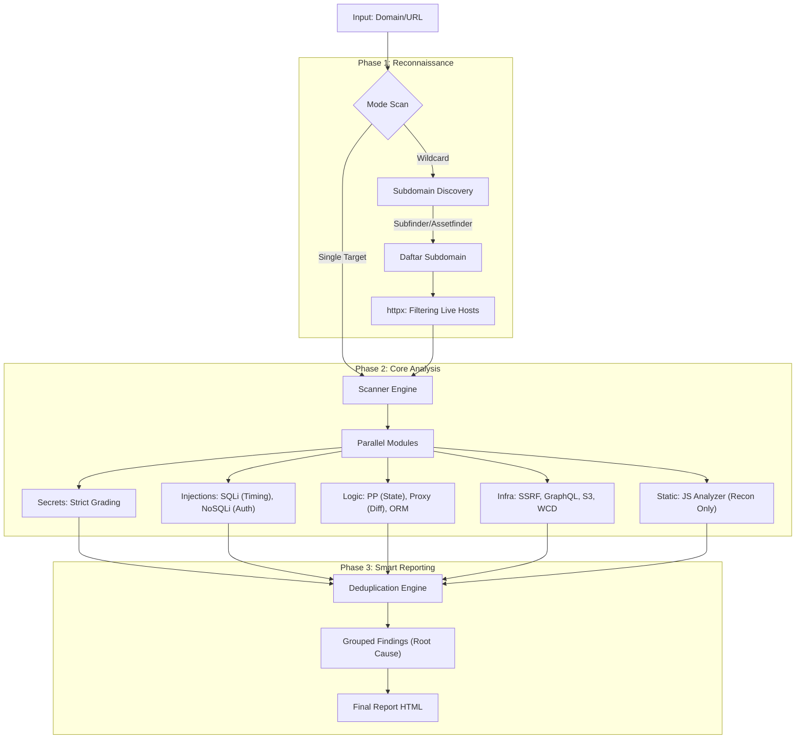

# BHYAKUGAN (ビャクガン) 👁️

[](https://golang.org/)
[](LICENSE)
[](https://github.com/areksaxyz/bhyakugan)

```text
   ▄▄▄▄    ██░ ██▓██   ██▓ ▄▄▄       ██ ▄█▀ █    ██   ▄████  ▄▄▄       ███▄    █
   ▓█████▄ ▓██░ ██▒▒██  ██▒▒████▄     ██▄█▒  ██  ▓██▒ ██▒ ▀█▒▒████▄     ██ ▀█   █
   ▒██▒ ▄██▒██▀▀██░ ▒██ ██░▒██  ▀█▄  ▓███▄░ ▓██  ▒██░▒██░▄▄▄░▒██  ▀█▄  ▓██  ▀█ ██▒
   ▒██░█▀  ░▓█ ░██  ░ ▐██▓░░██▄▄▄▄██ ▓██ █▄ ▓▓█  ░██░░▓█  ██▓░██▄▄▄▄██ ▓██▒  ▐▌██▒
   ░▓█  ▀█▓░▓█▒░██▓ ░ ██▒▓░ ▓█   ▓██▒▒██▒ █▄▒▒█████▓ ░▒▓███▀▒ ▓█   ▓██▒▒██░   ▓██░
   ░▒▓███▀▒ ▒ ░░▒░▒  ██▒▒▒  ▒▒   ▓▒█░▒ ▒▒ ▓▒░▒▓▒ ▒ ▒  ░▒   ▒  ▒▒   ▓▒█░░ ▒░   ▒ ▒
   ▒░▒   ░  ▒ ░▒░ ░▓██ ░▒░   ▒   ▒▒ ░░ ░▒ ▒░░░▒░ ░ ░   ░   ░   ▒   ▒▒ ░░ ░░   ░ ▒░
   ░    ░  ░  ░░ ░▒ ▒ ░░    ░   ▒   ░ ░░ ░  ░░░ ░ ░ ░ ░   ░   ░   ▒      ░   ░ ░
   ░       ░  ░  ░░ ░           ░  ░░  ░      ░           ░       ░  ░         ░
   ░         ░ ░
```

**Bhyakugan** adalah framework pemindaian backend otomatis berkecepatan tinggi yang dirancang khusus untuk Bug Bounty Hunter dan Security Researcher. Versi **3.5** (Production Ready) menghadirkan engine **Zero False Positive** yang telah teruji, deteksi cerdas berbasis state-change, dan logika validasi yang ketat.

## 🔥 Fitur Unggulan (v3.5)

### ✅ Production-Ready & Anti-Nodong
Scanner ini menggunakan logika deteksi "Enterprise-Grade" untuk menghilangkan false positive:
*   **Prototype Pollution**: Hanya melapor jika ada **State Change** (403->200) atau bypass auth nyata. Refleksi keyword diabaikan.
*   **SQL Injection**: Menggunakan **Strict Timing Check** (Baseline -> Payload -> Control -> Repeat) untuk membedakan antara vuln dan network lag/WAF tarpit.
*   **NoSQL Injection**: Mewajibkan bukti **Authentication Success** (Set-Cookie baru, token JSON, redirect ke admin).
*   **Proxy Bypass**: Menggabungkan temuan berdasarkan **Root Cause** (Header) dan memisahkan endpoint kritis vs info dalam satu laporan.
*   **Secrets Auditor**: Grading ketat (Plaintext/Dump = **Critical**, Config = **High**, Unverified = **Info**).

### ⚡ High-Concurrency Engine
*   Dioptimalkan untuk menangani **100+ koneksi simultan** per host.
*   Tidak ada lagi "macet" saat scanning target besar dengan banyak plugin aktif.

## 🌐 Arsitektur (Workflow)



## 🛠️ Instalasi

### Prasyarat
*   Go 1.21+
*   Tools eksternal (Opsional untuk mode Wildcard): `subfinder`, `assetfinder`, `httpx`

### Build dari Source
```bash
git clone https://github.com/areksaxyz/bhyakugan.git
cd bhyakugan
go build -o bhyakugan cmd/bhyakugan/main.go
```

## 📖 Penggunaan

### 1. Scan Wildcard (Rekomendasi untuk Bug Bounty)
Otomatis mencari subdomain, memfilter host hidup, dan men-scan seluruh infrastruktur.
```bash
./bhyakugan -domain google.com
```

### 2. Scan Target Tunggal
```bash
./bhyakugan -target https://api.example.com -depth 2
```

### 3. Custom Fuzzing
Gunakan wordlist eksternal untuk serangan LFI/RCE yang lebih brutal.
```bash
./bhyakugan -target https://example.com -payloads wordlists/LFI-Jhaddix.txt
```

### Opsi Flag
| Flag | Deskripsi |
| :--- | :--- |
| `-domain` | Domain utama untuk scan wildcard (Recon + Scan) |
| `-target` | URL spesifik untuk dipindai (Single Mode) |
| `-depth` | Kedalaman crawling (1 = page ini saja, 2+ = recursive) |
| `-payloads`| Path ke file wordlist kustom (Opsional) |
| `-timeout` | HTTP Timeout dalam detik (default: 10) |

## 📊 Output & Reporting
Hasil scan disimpan di folder `bhyakugan-output/` dengan format yang rapi:
*   **Report HTML**: Laporan visual interaktif dengan finding yang dikelompokkan.
*   **Findings TXT**: Log mentah untuk parsing lebih lanjut.
*   **Recon Data**: `subdomains.txt` dan `live_hosts.txt`.

## 🛡️ Modul Deteksi

| Kategori | Fitur Utama |
| :--- | :--- |
| **Injection** | SQLi (Time/Boolean/Error), NoSQLi (Auth Bypass), XPath, XSLT |
| **Logic** | Prototype Pollution (Server-Side), Proxy Misconfig (XFF), ORM Leak |
| **Server** | SSRF (Metadata/Internal), Advanced LFI (Wrapper/Base64), SSTI |
| **Auth** | JWT (None/Kid), SAML Discovery, Secrets (Active Validation) |
| **Infra** | GraphQL (Introspection/Batching), S3 Bucket, Web Cache Deception |

## ⚠️ Disclaimer
Bhyakugan dibuat untuk **Security Professionals**. Penggunaan tool ini untuk menyerang target tanpa izin tertulis adalah **ILEGAL**. Developer tidak bertanggung jawab atas penyalahgunaan tool ini.

---
Created with ❤️ by **areksaxyz**
