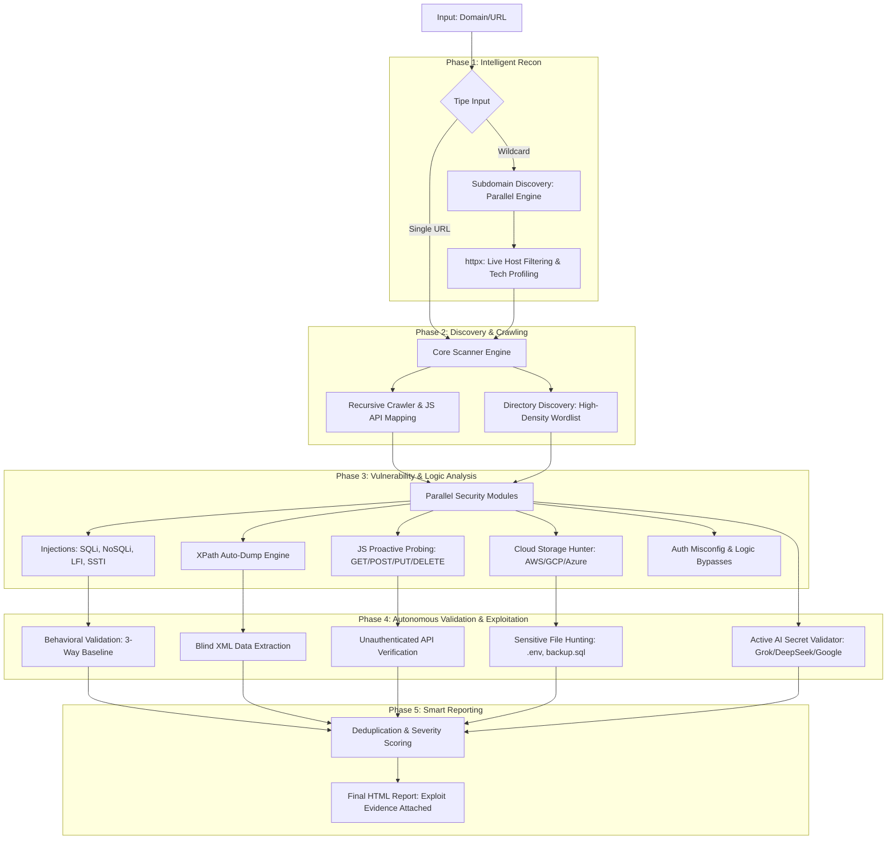

# BHYAKUGAN (ビャクガン) 👁️

[](https://golang.org/)
[](LICENSE)
[](https://github.com/areksaxyz/bhyakugan)

```text
   ▄▄▄▄    ██░ ██▓██   ██▓ ▄▄▄       ██ ▄█▀ █    ██   ▄████  ▄▄▄       ███▄    █
   ▓█████▄ ▓██░ ██▒▒██  ██▒▒████▄     ██▄█▒  ██  ▓██▒ ██▒ ▀█▒▒████▄     ██ ▀█   █
   ▒██▒ ▄██▒██▀▀██░ ▒██ ██░▒██  ▀█▄  ▓███▄░ ▓██  ▒██░▒██░▄▄▄░▒██  ▀█▄  ▓██  ▀█ ██▒
   ▒██░█▀  ░▓█ ░██  ░ ▐██▓░░██▄▄▄▄██ ▓██ █▄ ▓▓█  ░██░░▓█  ██▓░██▄▄▄▄██ ▓██▒  ▐▌██▒
   ░▓█  ▀█▓░▓█▒░██▓ ░ ██▒▓░ ▓█   ▓██▒▒██▒ █▄▒▒█████▓ ░▒▓███▀▒ ▓█   ▓██▒▒██░   ▓██░
   ░▒▓███▀▒ ▒ ░░▒░▒  ██▒▒▒  ▒▒   ▓▒█░▒ ▒▒ ▓▒░▒▓▒ ▒ ▒  ░▒   ▒  ▒▒   ▓▒█░░ ▒░   ▒ ▒
   ▒░▒   ░  ▒ ░▒░ ░▓██ ░▒░   ▒   ▒▒ ░░ ░▒ ▒░░░▒░ ░ ░   ░   ░   ▒   ▒▒ ░░ ░░   ░ ▒░
   ░    ░  ░  ░░ ░▒ ▒ ░░    ░   ▒   ░ ░░ ░  ░░░ ░ ░ ░ ░   ░   ░   ▒      ░   ░ ░
   ░       ░  ░  ░░ ░           ░  ░░  ░      ░           ░       ░  ░         ░
   ░         ░ ░
```

**Bhyakugan** adalah framework pemindaian backend otomatis berkecepatan tinggi yang dirancang khusus untuk Bug Bounty Hunter dan Security Researcher. Versi **4.0 (Autonomous Upgrade)** menghadirkan engine eksploitasi otomatis, dukungan multi-cloud, dan analisis endpoint JavaScript yang lebih agresif.

## 🔥 Fitur Unggulan (v4.0)

### 🎯 Autonomous Exploit Engine
*   **XPath XML Dumping**: Tidak hanya mendeteksi *boolean differential*, Bhyakugan sekarang secara otomatis melakukan *blind-dumping* nama node, jumlah elemen, dan atribut XML internal menggunakan teknik `count()`, `string-length()`, dan `substring()`.
*   **Multi-Cloud Bucket Hunter**: Jangkauan diperluas ke **AWS S3, Google Cloud Storage (GCP), dan Azure Blob**. Engine secara otomatis melakukan **Sensitive File Hunting** (mencari `.env`, `backup.sql`, `users.json`) di dalam bucket publik dan menaikkan severity menjadi **Critical** jika ditemukan.
*   **Active AI Secret Validator**: Menambahkan dukungan untuk **xAI (Grok)** dan **DeepSeek** API Keys dengan logic validasi saldo/quota otomatis.

### 🔍 Proactive JS API Mapper
*   **Method Probing**: Setiap endpoint API yang ditemukan di dalam file JavaScript otomatis ditembak menggunakan berbagai method HTTP (`GET`, `POST`, `PUT`, `DELETE`) dengan *No-Redirect Client* untuk menemukan akses unauthenticated pada fitur tersembunyi.
*   **Firebase Config Extraction**: Regex spesifik untuk mengekstrak objek konfigurasi Firebase lengkap untuk mempermudah identifikasi *misconfiguration* pada Firebase Installation API.
*   **Smart Sourcemap Triage**: Membedakan antara library pihak ketiga (Low) dan kode internal aplikasi seperti `app.js.map` atau `admin.js.map` (Medium) untuk mengurangi noise.

### ✅ Enterprise-Grade Scanning
*   **Enhanced Directory Wordlist**: Penambahan massal path sensitif termasuk `.bzr/`, `.hg/`, `WEB-INF/`, serta berbagai variasi file backup dan konfigurasi modern.
*   **Open Redirect Module**: Deteksi otomatis celah redirect menggunakan parameter umum (`next`, `redir`, `url`) dengan payload bypass modern.
*   **Unauthenticated File Upload**: Mencoba melakukan upload file `.php` dummy ke endpoint yang dicurigai sebagai uploader untuk memverifikasi proteksi filter.

## 🛠️ Instalasi

### Prasyarat
*   Go 1.21+
*   Tools pendukung: `subfinder`, `assetfinder`, `httpx`

### Build dari Source
```bash
git clone https://github.com/areksaxyz/bhyakugan.git
cd bhyakugan
go build -o bhyakugan cmd/bhyakugan/main.go
```

## 📖 Penggunaan

### 1. Scan Target Tunggal (Balanced - Recommended)
```bash
./bhyakugan -target https://api.example.com -mode balanced
```

### 2. Scan Wildcard (Consistent Mode)
Alat akan memuat data lama dan menambah temuan baru secara otomatis.
```bash
./bhyakugan -domain example.com -depth 1
```

## 🛡️ Modul Deteksi Elite

| Kategori | Fitur Utama |
| :--- | :--- |
| **Injections** | **XPath Auto-Dump**, SQLi, NoSQLi, SSRF, LFI, SSTI, PHP Type Juggling |
| **Cloud Exposure** | **AWS S3, GCP Storage, Azure Blob** (with Sensitive File Hunting) |
| **JS Analysis** | **API Probing**, XSSI, Sourcemap Leak, Firebase Config, CryptoJS Secrets |
| **API Keys** | **xAI (Grok), DeepSeek**, Google, AWS, GitHub, OpenAI, dll (with Validation) |
| **Vulns** | **Open Redirect**, **Unauthenticated File Upload**, JWT none-alg, SAML Stripping |

## 🌐 Arsitektur & Alur Kerja (Workflow)

Bhyakugan beroperasi dengan pipeline **Scan-Validate-Exploit-Score** yang terintegrasi secara otomatis:



### Detil Alur Kerja:

1.  **Reconnaissance (Wildcard Mode)**: Jika input berupa domain, Bhyakugan menjalankan `subfinder`, `assetfinder`, dan `crt.sh` secara paralel, melakukan deduplikasi, dan memfilter host aktif menggunakan `httpx`.
2.  **Profiling & Baseline**: Sebelum memindai, engine melakukan *Profiling* (deteksi Bahasa, Framework, WAF) dan mengumpulkan *Baseline* respon normal untuk deteksi berbasis perilaku (*behavioral analysis*).
3.  **Discovery Phase**:
    *   **Directory Discovery**: Menyisir ribuan *hidden path* menggunakan wordlist yang telah ditingkatkan.
    *   **JS API Mapper**: Mengekstrak endpoint API dari file JavaScript dan langsung melakukan **Probing Aktif** (mencoba method HTTP yang berbeda) untuk mencari akses tanpa otentikasi.
4.  **Vulnerability Pipeline**: Menjalankan modul injeksi dan logika secara paralel. Modul khusus seperti **XPath Engine** akan otomatis beralih ke mode **Auto-Dump** jika differential terdeteksi.
5.  **Multi-Cloud Hunter**: Jika ditemukan referensi cloud storage, engine akan memverifikasi izin bucket (AWS/GCP/Azure) dan secara agresif mencari file sensitif seperti `.env` atau `backup.sql`.
6.  **Autonomous Validation**: Setiap temuan *secret* (API Key) divalidasi langsung ke provider (Google, Grok, DeepSeek, dll) untuk memastikan apakah key tersebut valid, memiliki saldo, atau bisa disalahgunakan.
7.  **Smart Scoring & Reporting**: Hasil akhir dikonsolidasikan, dihilangkan duplikasinya, dan diberi skor berdasarkan tingkat eksploitasi nyata (bukan sekadar regex match) dalam laporan HTML yang komprehensif.

## ⚠️ Disclaimer
Bhyakugan dibuat untuk **Security Professionals**. Penggunaan tool ini untuk menyerang target tanpa izin tertulis adalah **ILEGAL**. Developer tidak bertanggung jawab atas penyalahgunaan tool ini.

---
Created with ❤️ by **areksaxyz (Arga Reksapati)**
