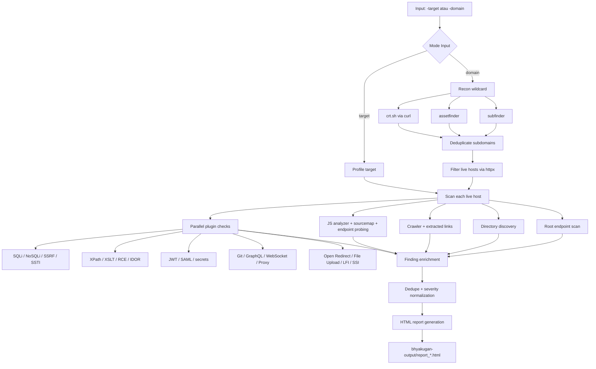

# BHYAKUGAN (ビャクガン) 👁️

[](https://golang.org/)
[](LICENSE)
[](https://github.com/areksaxyz/bhyakugan)

```text
   ▄▄▄▄    ██░ ██▓██   ██▓ ▄▄▄       ██ ▄█▀ █    ██   ▄████  ▄▄▄       ███▄    █
   ▓█████▄ ▓██░ ██▒▒██  ██▒▒████▄     ██▄█▒  ██  ▓██▒ ██▒ ▀█▒▒████▄     ██ ▀█   █
   ▒██▒ ▄██▒██▀▀██░ ▒██ ██░▒██  ▀█▄  ▓███▄░ ▓██  ▒██░▒██░▄▄▄░▒██  ▀█▄  ▓██  ▀█ ██▒
   ▒██░█▀  ░▓█ ░██  ░ ▐██▓░░██▄▄▄▄██ ▓██ █▄ ▓▓█  ░██░░▓█  ██▓░██▄▄▄▄██ ▓██▒  ▐▌██▒
   ░▓█  ▀█▓░▓█▒░██▓ ░ ██▒▓░ ▓█   ▓██▒▒██▒ █▄▒▒█████▓ ░▒▓███▀▒ ▓█   ▓██▒▒██░   ▓██░
   ░▒▓███▀▒ ▒ ░░▒░▒  ██▒▒▒  ▒▒   ▓▒█░▒ ▒▒ ▓▒░▒▓▒ ▒ ▒  ░▒   ▒  ▒▒   ▓▒█░░ ▒░   ▒ ▒
   ▒░▒   ░  ▒ ░▒░ ░▓██ ░▒░   ▒   ▒▒ ░░ ░▒ ▒░░░▒░ ░ ░   ░   ░   ▒   ▒▒ ░░ ░░   ░ ▒░
   ░    ░  ░  ░░ ░▒ ▒ ░░    ░   ▒   ░ ░░ ░  ░░░ ░ ░ ░ ░   ░   ░   ▒      ░   ░ ░
   ░       ░  ░  ░░ ░           ░  ░░  ░      ░           ░       ░  ░         ░
   ░         ░ ░
```

**Bhyakugan** adalah scanner backend berbasis Go untuk recon, discovery, dan triage temuan keamanan pada target web. README ini mendeskripsikan tool, dependency, mode operasi, output, dan corpus wordlist yang benar-benar ada di repo, bukan narasi rilis.

## 🔧 Tooling yang Dipakai

### Binary utama
*   `./cmd/bhyakugan`: entrypoint scanner CLI.
*   `./cmd/mockserver`: target lokal yang sengaja rentan untuk regression dan demo.

### Dependency eksternal
*   `subfinder`: subdomain discovery pada mode wildcard.
*   `assetfinder`: subdomain discovery tambahan pada mode wildcard.
*   `httpx`: filtering host aktif pada hasil recon.
*   `curl`: query `crt.sh` pada mode wildcard.
*   `PayloadsAllTheThings` opsional: dipakai jika Anda menyediakan path lewat `-patt` atau `BHYAKUGAN_PATT`.

Jika tool di atas tidak ada, engine recon akan memberi warning eksplisit dan menjalankan bagian yang masih tersedia.

## 🧩 Komponen Utama

### Core
*   Pipeline finding dengan enrichment, normalization, dedupe, dan HTML report.
*   Scanner multi-mode: `strict`, `balanced`, `aggressive`, plus alias `bounty` dan `lab`.
*   Crawl dan follow-up scan dengan endpoint cap otomatis per host.

### Plugin yang ada di repo
*   Recon dan discovery: directories, GraphQL, Git exposure, JS analyzer, HTML recon.
*   Injection dan logic checks: SQLi, NoSQLi, SSRF, SSTI, XPath, XSLT, RCE, IDOR, proxy bypass, type juggling, prototype pollution.
*   Auth dan token related: JWT, SAML, secrets validation.
*   Exposure checks: file upload, open redirect, LFI, SSI, cloud storage exposure.

### Artifact dan script
*   `Makefile`: `build`, `test`, `fmt`, `vet`.
*   `scripts/regression_local.sh`: build + package-level regression lokal.
*   `scripts/localhost_fullstack_regression.sh`: fullstack localhost regression terhadap mockserver.
*   `.github/workflows/ci.yml`: build, test, dan vet untuk push / pull request.

## 🛠️ Instalasi

### Prasyarat
*   Go 1.21
*   Tool eksternal opsional untuk wildcard recon: `subfinder`, `assetfinder`, `httpx`, `curl`

### Build dari Source
```bash
git clone https://github.com/areksaxyz/bhyakugan.git
cd bhyakugan
make build
```

Alternatif manual:
```bash
go build -ldflags="-X main.version=4.0.0" -o bhyakugan ./cmd/bhyakugan
```

Gunakan package `./cmd/bhyakugan` sebagai target build resmi. Root module bukan target `go build .`.

## 📖 Penggunaan

### Scan Target Tunggal
```bash
./bhyakugan -target https://api.example.com -mode balanced
```

### Scan Wildcard
```bash
./bhyakugan -domain example.com -depth 1
```

### Dengan PayloadsAllTheThings
```bash
./bhyakugan -target https://api.example.com -mode strict -patt /path/to/PayloadsAllTheThings
```

### Flag penting
*   `-target`: target URL tunggal.
*   `-domain`: domain untuk recon wildcard.
*   `-mode`: `strict`, `balanced`, `aggressive`, `bounty`, `lab`.
*   `-depth`: kedalaman crawling.
*   `-threads`: concurrency worker.
*   `-fast`: triage cepat, mengurangi modul berat.
*   `-strict-validation`: drop finding heuristik-only.
*   `-max-endpoints`: limit endpoint per host. `0` berarti auto by mode.
*   `-patt`: root repo `PayloadsAllTheThings`.

## 🧭 Workflow Tool



### Single target
1.  Profiling target.
2.  Endpoint scan root.
3.  Directory discovery dan crawler.
4.  JS analysis dan plugin scan paralel.
5.  Enrichment, dedupe, scoring, lalu HTML report.

### Wildcard target
1.  `subfinder`, `assetfinder`, dan `crt.sh` dijalankan paralel bila tersedia.
2.  Hasil disaring dengan `httpx`.
3.  Setiap live host dipindai dengan scanner yang sama seperti mode single target.

## 🗂️ Wordlists dan Corpus

Repo ini sekarang menyimpan corpus lokal di `wordlists/` dengan dua bentuk:

*   Flat files untuk kompatibilitas lama.
*   Tiered layout:
    `wordlists/discovery`
    `wordlists/verify`
    `wordlists/aggressive`

Contoh yang sudah ada:
*   Discovery: `paths-common.txt`, `paths-admin.txt`, `paths-backups.txt`, `paths-api.txt`, `graphql-endpoints.txt`, `openredirect-params.txt`, `idor-params.txt`, `ssrf-params.txt`, `upload-params.txt`, `auth-params.txt`, `debug-params.txt`, `cloud-metadata-paths.txt`
*   Verify: `graphql-safe-probes.txt`, `upload-safe-filenames.txt`, `upload-safe-content-types.txt`, `response-interesting-keywords.txt`, `js-secret-keywords.txt`, `js-endpoint-keywords.txt`, `cors-interesting-headers.txt`, `file-interesting-names.txt`
*   Aggressive: upload bypass filenames/extensions dan SQLi DB-specific lists

Catatan: tidak semua file wordlist sudah di-wire otomatis ke semua plugin. Sebagian masih berfungsi sebagai corpus repo yang siap dipakai pada wiring berikutnya.

## 📄 Output

*   Report HTML ditulis ke `bhyakugan-output/`.
*   Direktori output dibuat dengan permission privat (`0700`), file report/list dengan `0600`.
*   HTML report sudah meng-escape field dinamis dan membatasi hyperlink ke `http/https`.

## 🧪 Regression

```bash
make test
./scripts/regression_local.sh
./scripts/localhost_fullstack_regression.sh
```

`cmd/mockserver` dipakai sebagai target lokal untuk regression dan demo flow.

## ⚠️ Catatan Praktis

*   Mode wildcard bergantung pada tool eksternal. Coverage recon akan turun jika dependency tidak ada.
*   Beberapa plugin masih heuristik dan lebih cocok untuk triage awal daripada keputusan final tanpa verifikasi manual.
*   `-fast` dan endpoint cap otomatis lebih aman untuk target besar dibanding scan agresif penuh.

## ⚠️ Disclaimer
Bhyakugan dibuat untuk **Security Professionals**. Penggunaan tool ini untuk menyerang target tanpa izin tertulis adalah **ILEGAL**. Developer tidak bertanggung jawab atas penyalahgunaan tool ini.

---
Created with ❤️ by **areksaxyz (Arga Reksapati)**
