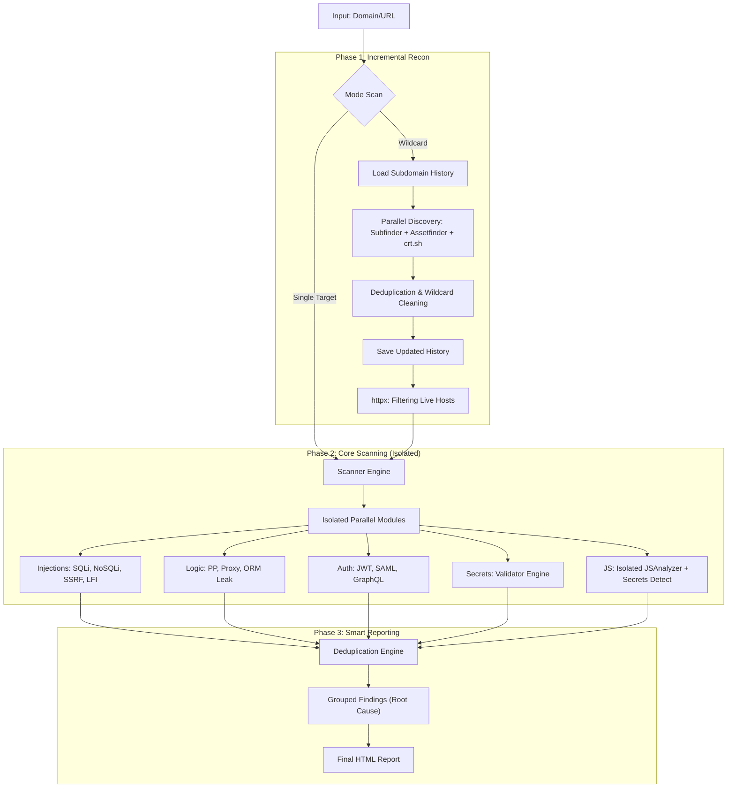

# BHYAKUGAN (ビャクガン) 👁️

[](https://golang.org/)
[](LICENSE)
[](https://github.com/areksaxyz/bhyakugan)

```text
   ▄▄▄▄    ██░ ██▓██   ██▓ ▄▄▄       ██ ▄█▀ █    ██   ▄████  ▄▄▄       ███▄    █
   ▓█████▄ ▓██░ ██▒▒██  ██▒▒████▄     ██▄█▒  ██  ▓██▒ ██▒ ▀█▒▒████▄     ██ ▀█   █
   ▒██▒ ▄██▒██▀▀██░ ▒██ ██░▒██  ▀█▄  ▓███▄░ ▓██  ▒██░▒██░▄▄▄░▒██  ▀█▄  ▓██  ▀█ ██▒
   ▒██░█▀  ░▓█ ░██  ░ ▐██▓░░██▄▄▄▄██ ▓██ █▄ ▓▓█  ░██░░▓█  ██▓░██▄▄▄▄██ ▓██▒  ▐▌██▒
   ░▓█  ▀█▓░▓█▒░██▓ ░ ██▒▓░ ▓█   ▓██▒▒██▒ █▄▒▒█████▓ ░▒▓███▀▒ ▓█   ▓██▒▒██░   ▓██░
   ░▒▓███▀▒ ▒ ░░▒░▒  ██▒▒▒  ▒▒   ▓▒█░▒ ▒▒ ▓▒░▒▓▒ ▒ ▒  ░▒   ▒  ▒▒   ▓▒█░░ ▒░   ▒ ▒
   ▒░▒   ░  ▒ ░▒░ ░▓██ ░▒░   ▒   ▒▒ ░░ ░▒ ▒░░░▒░ ░ ░   ░   ░   ▒   ▒▒ ░░ ░░   ░ ▒░
   ░    ░  ░  ░░ ░▒ ▒ ░░    ░   ▒   ░ ░░ ░  ░░░ ░ ░ ░ ░   ░   ░   ▒      ░   ░ ░
   ░       ░  ░  ░░ ░           ░  ░░  ░      ░           ░       ░  ░         ░
   ░         ░ ░
```

**Bhyakugan** adalah framework pemindaian backend otomatis berkecepatan tinggi yang dirancang khusus untuk Bug Bounty Hunter dan Security Researcher. Versi **3.7** menghadirkan stabilitas tinggi dengan engine **Anti-Stuck**, pencarian subdomain **Inkremental**, integrasi payload dari **PayloadsAllTheThings**, serta mode scan bertingkat untuk menekan false positive.

## 🔥 Fitur Unggulan (v3.7)

### 🚀 Advanced Recon (Consistent & Aggressive)
*   **Incremental Discovery**: Menyimpan riwayat subdomain di `bhyakugan-output/`. Hasil pencarian tidak akan pernah berkurang antar sesi.
*   **Triple Threat Recon**: Menggabungkan `subfinder (-all)`, `assetfinder`, dan kueri langsung ke **crt.sh API**.
*   **httpx Optimized**: Filter host hidup dengan rate-limit dan timeout cerdas untuk mencegah hang pada infrastruktur besar.

### ✅ Enterprise-Grade Detection (Zero False Positive)
*   **SQL Injection**: Menggunakan **Strict Timing Check** (Baseline -> Payload -> Control) dengan payload terbaru (RLIKE, ELT, BENCHMARK).
*   **Isolated JS Analysis**: Engine analisis JavaScript sekarang berjalan secara terisolasi dengan *timeout* mandiri. Analisa file JS yang lambat tidak akan menahan proses pemindaian host.
*   **SSRF Evolution**: Deteksi metadata cloud (AWS, Azure, GCP, DigitalOcean, Oracle) dan bypass localhost tingkat lanjut.
*   **LFI & Wrapper**: Deteksi mendalam menggunakan PHP filter base64 dengan verifikasi konten otomatis untuk menghindari *Soft 404*.
*   **Confidence-Aware Reporting**: Setiap finding diberi confidence (`confirmed`, `probable`, `noisy`) dan difilter sesuai mode scan.
*   **Scan Modes**: `strict` (default), `balanced`, `aggressive` untuk menyesuaikan kedalaman dan toleransi noise.
*   **Fast Triage Profile**: Opsi `-fast` untuk skrining cepat target besar tanpa modul paling berat.

## 🌐 Arsitektur (Workflow)



## 🛠️ Instalasi

### Prasyarat
*   Go 1.21+
*   Tools pendukung: `subfinder`, `assetfinder`, `httpx`

### Build dari Source
```bash
git clone https://github.com/areksaxyz/bhyakugan.git
cd bhyakugan
go build -o bhyakugan cmd/bhyakugan/main.go
```

## 📖 Penggunaan

### 1. Scan Wildcard (Consistent Mode)
Alat akan memuat data lama dan menambah temuan baru secara otomatis.
```bash
./bhyakugan -domain ugm.ac.id -depth 1
```

### 2. Scan Target Tunggal (Strict)
```bash
./bhyakugan -target https://api.example.com -depth 2
```

### 3. Scan Cepat (Fast Triage)
```bash
./bhyakugan -target https://api.example.com -mode strict -fast -max-endpoints 20
```

### 4. Scan dengan PayloadsAllTheThings Kustom
```bash
./bhyakugan -target https://api.example.com \
  -patt /home/user/tools/PayloadsAllTheThings \
  -mode balanced
```

### Opsi Flag
| Flag | Deskripsi |
| :--- | :--- |
| `-domain` | Domain utama untuk scan wildcard (Recon + Scan) |
| `-target` | URL spesifik untuk dipindai (Single Mode) |
| `-depth` | Kedalaman crawling (1 = page ini saja, 2+ = recursive) |
| `-payloads`| Path ke file wordlist kustom (Opsional) |
| `-timeout` | HTTP Timeout dalam detik (default: 10) |
| `-mode` | Mode scan: `strict`, `balanced`, `aggressive` (default: `strict`) |
| `-fast` | Profil triage cepat (mengurangi modul berat dan waktu scan) |
| `-max-endpoints` | Batas endpoint per host (0 = auto/unlimited, di `-fast` akan dibatasi otomatis) |
| `-patt` | Path ke repo `PayloadsAllTheThings` (default: `/home/yupiyy/tools/bug/PayloadsAllTheThings`) |

## 🎯 Mode Scan

| Mode | Karakteristik |
| :--- | :--- |
| **strict** | Fokus high-confidence, menyaring finding `noisy`, cocok untuk bug bounty submission |
| **balanced** | Menampilkan `confirmed` + `probable`, kompromi antara coverage dan noise |
| **aggressive** | Menampilkan semua finding (termasuk yang berisiko noise), cocok untuk riset manual |

## 📊 Confidence Finding

| Confidence | Makna |
| :--- | :--- |
| **confirmed** | Bukti eksploitasi/indikator kuat tervalidasi |
| **probable** | Indikasi kuat tapi masih butuh validasi manual |
| **noisy** | Sinyal lemah/ambigu, berpotensi false positive |

## 🛡️ Modul Deteksi

| Kategori | Fitur Utama |
| :--- | :--- |
| **Injection** | SQLi (Advanced Time-Based), NoSQLi, SSRF (Cloud Meta), LFI (Wrappers) |
| **Logic** | Prototype Pollution, Proxy Misconfig, ORM Leak, SAML/JWT |
| **Recon** | Isolated JS Analysis, Subdomain History, S3 Bucket Verification |
| **Secrets** | Active Key Validation (OpenAI, AWS, GitHub, Stripe, dll) |

## ⚠️ Disclaimer
Bhyakugan dibuat untuk **Security Professionals**. Penggunaan tool ini untuk menyerang target tanpa izin tertulis adalah **ILEGAL**. Developer tidak bertanggung jawab atas penyalahgunaan tool ini.

---
Created with ❤️ by **areksaxyz (Muhamad Arga Reksapati)**
