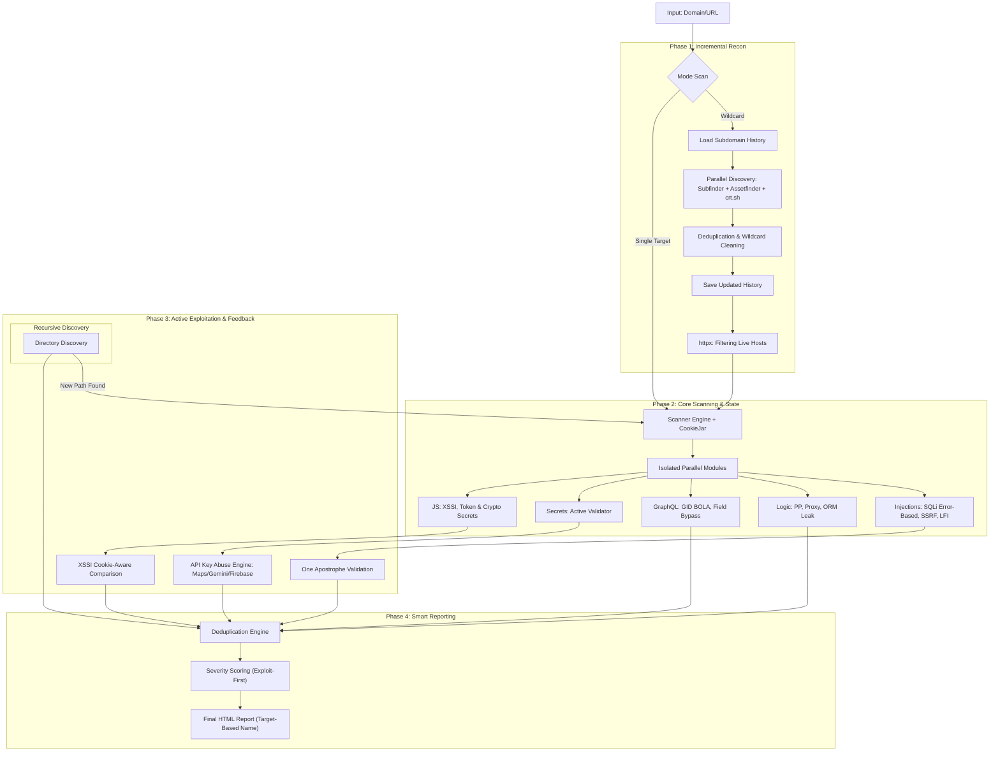

# BHYAKUGAN (ビャクガン) 👁️

[](https://golang.org/)
[](LICENSE)
[](https://github.com/areksaxyz/bhyakugan)

```text
   ▄▄▄▄    ██░ ██▓██   ██▓ ▄▄▄       ██ ▄█▀ █    ██   ▄████  ▄▄▄       ███▄    █
   ▓█████▄ ▓██░ ██▒▒██  ██▒▒████▄     ██▄█▒  ██  ▓██▒ ██▒ ▀█▒▒████▄     ██ ▀█   █
   ▒██▒ ▄██▒██▀▀██░ ▒██ ██░▒██  ▀█▄  ▓███▄░ ▓██  ▒██░▒██░▄▄▄░▒██  ▀█▄  ▓██  ▀█ ██▒
   ▒██░█▀  ░▓█ ░██  ░ ▐██▓░░██▄▄▄▄██ ▓██ █▄ ▓▓█  ░██░░▓█  ██▓░██▄▄▄▄██ ▓██▒  ▐▌██▒
   ░▓█  ▀█▓░▓█▒░██▓ ░ ██▒▓░ ▓█   ▓██▒▒██▒ █▄▒▒█████▓ ░▒▓███▀▒ ▓█   ▓██▒▒██░   ▓██░
   ░▒▓███▀▒ ▒ ░░▒░▒  ██▒▒▒  ▒▒   ▓▒█░▒ ▒▒ ▓▒░▒▓▒ ▒ ▒  ░▒   ▒  ▒▒   ▓▒█░░ ▒░   ▒ ▒
   ▒░▒   ░  ▒ ░▒░ ░▓██ ░▒░   ▒   ▒▒ ░░ ░▒ ▒░░░▒░ ░ ░   ░   ░   ▒   ▒▒ ░░ ░░   ░ ▒░
   ░    ░  ░  ░░ ░▒ ▒ ░░    ░   ▒   ░ ░░ ░  ░░░ ░ ░ ░ ░   ░   ░   ▒      ░   ░ ░
   ░       ░  ░  ░░ ░           ░  ░░  ░      ░           ░       ░  ░         ░
   ░         ░ ░
```

**Bhyakugan** adalah framework pemindaian backend otomatis berkecepatan tinggi yang dirancang khusus untuk Bug Bounty Hunter dan Security Researcher. Versi **3.8** menghadirkan engine **Exploitation-First**, deteksi GraphQL tingkat lanjut, analisis JS yang lebih mendalam, dan logic validasi kredensial otomatis.

## 🔥 Fitur Unggulan (v3.8)

### 🎯 Exploitation-First Engine
*   **Active API Key Abuse**: Tidak hanya menemukan pola, Bhyakugan secara aktif mencoba menggunakan API Key yang ditemukan (Google Maps, Vision, Gemini, Firebase) untuk memverifikasi apakah key tersebut benar-benar *vulnerable* atau *restricted*.
*   **GraphQL Elite Detection**:
    *   **GID BOLA**: Mencoba mengakses objek privat menggunakan teknik *Global ID* (H1 inspired).
    *   **Field-Level Bypass**: Mencoba teknik *Pivot Query* (Org -> Project -> Webhook) untuk melewati proteksi izin pada level root.
*   **One Apostrophe SQLi**: Pendekatan agresif terhadap parameter sensitif (`companyID`, `fundId`, `userId`) dengan verifikasi pesan error database eksplisit.

### 🔍 Advanced JS Analyzer
*   **XSSI Detection**: Teknik perbandingan respon (*Cookie-aware*) untuk mendeteksi file JS dinamis yang membocorkan data sesi cross-origin.
*   **Secret Constant Extraction**: Mencari hardcoded secrets di JS seperti konstanta penandatanganan (CryptoJS) dan variabel token sensitif.
*   **Auto-Redirect Scanning**: Scanner sekarang mengikuti redirect (`301/302`) untuk memastikan konten di halaman dashboard terekstrak dengan benar.

### ✅ Enterprise-Grade Scanning
*   **Stateful Scanning**: Mendukung `CookieJar` untuk menyimpan sesi selama pemindaian, memungkinkan deteksi celah yang hanya muncul setelah otentikasi.
*   **Auto-Scan Discovered Paths**: Setiap path baru yang ditemukan oleh module direktori otomatis di-scan ulang oleh seluruh plugin (Injections, Auth, Logic).
*   **Smart HTML Reporting**: Laporan HTML sekarang konsisten berdasarkan nama target (tidak lagi membuat banyak file dengan timestamp) dan menyertakan preview respon yang rentan.

## 🛠️ Instalasi

### Prasyarat
*   Go 1.21+
*   Tools pendukung: `subfinder`, `assetfinder`, `httpx`

### Build dari Source
```bash
git clone https://github.com/areksaxyz/bhyakugan.git
cd bhyakugan
go build -o bhyakugan cmd/bhyakugan/main.go
```

## 📖 Penggunaan

### 1. Scan Target Tunggal (Balanced - Recommended)
```bash
./bhyakugan -target https://api.example.com -mode balanced
```

### 2. Scan Wildcard (Consistent Mode)
Alat akan memuat data lama dan menambah temuan baru secara otomatis.
```bash
./bhyakugan -domain example.com -depth 1
```

### Opsi Flag
| Flag | Deskripsi |
| :--- | :--- |
| `-domain` | Domain utama untuk scan wildcard (Recon + Scan) |
| `-target` | URL spesifik untuk dipindai (Single Mode) |
| `-depth` | Kedalaman crawling (1 = page ini saja, 2+ = recursive) |
| `-mode` | Mode scan: `strict`, `balanced`, `aggressive`, `bounty`, `lab` (default: `balanced`) |
| `-fast` | Profil triage cepat (mengurangi modul berat dan waktu scan) |
| `-max-endpoints` | Batas endpoint per host (0 = auto/unlimited) |

## 🎯 Mode Scan

| Mode | Karakteristik |
| :--- | :--- |
| **strict** | Hanya menampilkan Critical/High yang sudah tervalidasi (Confirmed). |
| **balanced** | Rekomendasi utama. Menampilkan temuan valid (Low-Critical) tanpa terlalu banyak noise. |
| **aggressive** | Menampilkan semua sinyal meskipun lemah. Cocok untuk environment lab. |

## 🛡️ Modul Deteksi Elite

| Kategori | Fitur Utama |
| :--- | :--- |
| **GraphQL** | Introspection, Batching, GID BOLA, Field-Level Bypass (PII Leak) |
| **JS Analysis** | XSSI Detection, Sourcemap Leak, Token Extraction, CryptoJS Secrets |
| **API Keys** | Active Abuse Testing (Google Services, AWS, GitHub, OpenAI, dll) |
| **Injections** | SQLi (Error & Time-based), NoSQLi, SSRF (Cloud Meta), LFI (PHP Wrappers) |
| **Logic** | Proxy Header Trust, Prototype Pollution, SAML Signature Stripping, JWT none-alg |

## 🌐 Arsitektur (Workflow)



## ⚠️ Disclaimer
Bhyakugan dibuat untuk **Security Professionals**. Penggunaan tool ini untuk menyerang target tanpa izin tertulis adalah **ILEGAL**. Developer tidak bertanggung jawab atas penyalahgunaan tool ini.

---
Created with ❤️ by **areksaxyz (Arga Reksapati)**
